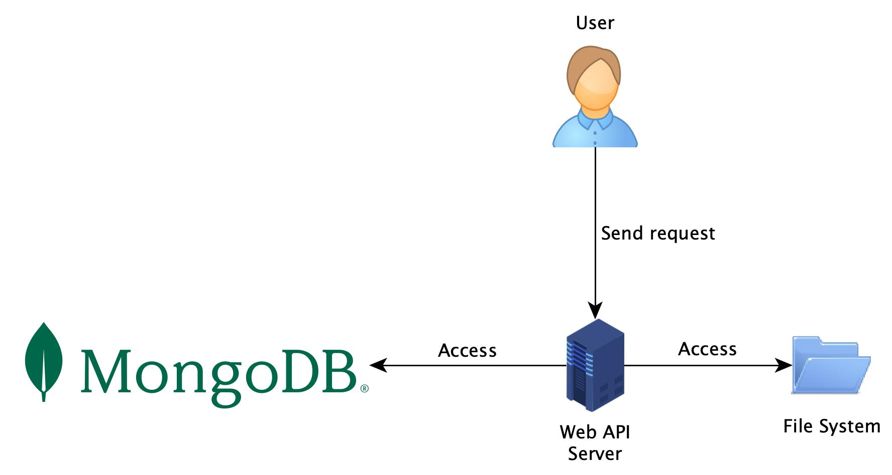
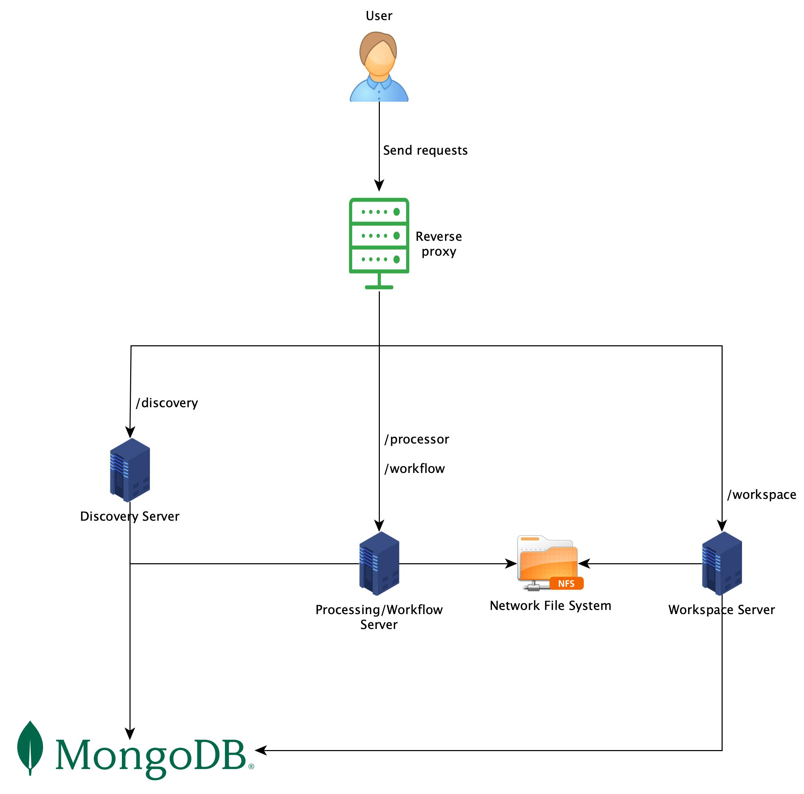
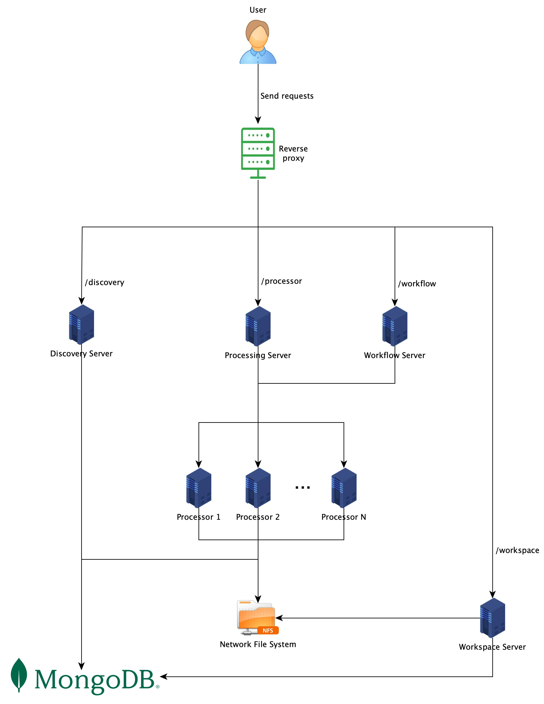

# Web API

## Why do we need a Web API?

The purpose of this specification is to improve the interoperability between Implementation Projects (IP). Based on a
common API definition, users can interact with different systems built by different IPs in the same way.

## The Specification

The Web API specification can be found [here](openapi.yml). It follows
the [OpenAPI specification](https://swagger.io/specification/). There are 4 parts to be implemented: discovery,
processing, workflow, and workspace.

**Discovery**: The service endpoints in this section provide information about the server. They include, but are not limited to,
hardware configuration, installed processors, and information about each processor.

**Processing**: Via the service endpoints in this section, one can get information about a specific [processor](https://ocr-d.de/en/spec/glossary#ocr-d-processor),
trigger a processor run, and check a status of a running processor. By exposing these endpoints, the server can encapsulate the
detailed setup of the system and offer users a single entry to the processors.

**Workflow**: Beyond single processors one can manage entire [workflows](https://ocr-d.de/en/spec/glossary#ocr-d-workflow), i.e. a series of connected processor configurations. 
In this spec, a workflow amounts to a [Nextflow](https://www.nextflow.io/) script. Some information about Nextflow and how to
use it in OCR-D is documented [here](nextflow.md).

**Workspace**: The service endpoints in this section concern data management, which in OCR-D is handled via [workspaces](https://ocr-d.de/en/spec/glossary#workspace). 
Processing (via single processors or workflows) always refers to existing workspaces.

## Usage

When a system implements the Web API completely, it can be used as follows:

1. User gets information about the system via endpoints in the `Discovery` section.
2. User creates a workspace via the `POST /workspace` endpoint and gets back a workspace ID.
3. User creates a workflow by uploading a Nextflow script to the system via the `POST /workflow` endpoint and get back a
   workflow ID.
4. User can either:
    * Trigger a single processor on a workspace by calling the `POST /processor/{executable}` endpoint with the chosen
      processor name and workspace ID, or
    * Start a workflow on a workspace by calling the `POST /workflow/{workflow-id}` endpoint with the chosen workflow ID
      and workspace ID.
    * In both case, a job ID is returned to the user.
5. With the given job ID, user can check the job status by calling:
    * `GET /processor/{executable}/{job-id}` for a single processor, or
    * `GET /workflow/{workflow-id}/{job-id}` for the workflow.
6. The result can be downloaded by calling the `GET /workspace/{workspace-id}` endpoint with the
   header `Accept: application/vnd.ocrd+zip`. Without that header, only the metadata of the specified workspace is
   returned.

## Suggested Architecture for Implementors

There are various ways to build a system which implements this Web API. 
In this section, we describe 3 different architectures, starting from the simplest setup. 
These are meant for illustrative purposes only – implementors do not need to strictly follow any one of them,
but should choose an approach which best fits their situation.

### Centralized System Architecture

In the most simple case, everything is implemented and installed in one server, as shown in Figure 1. 
The OCR-D Server implements all Web API endpoints from this specification.
On the same machine, all processors and Nextflow are installed, either natively or using Docker.
Whenever a request arrives, the OCR-D Server just calls the appropriate processor CLI, e.g. `ocrd-[processor]`,
or Nextflow related command, and returns its results.

<figure>
  
  <figcaption align="center">
    <b>Fig. 1:</b> The simplest architecture, where a server implements all endpoints and has all processors as well as Nextflow installed locally.
  </figcaption>
</figure>

A database is needed to store necessary information such as users requests, jobs status, workspace paths etc. We
recommend to use [MongoDB](https://www.mongodb.com/) since it is used by the [Processor API](#rest-api-for-processors),
but other kinds of storage may work as well.

The OCR-D Server requires access to the file system in order to manage workspaces. In this simple setup, the
file system can just be the local file system of the machine where the OCR-D Server is deployed.

### Multiple Server Architecture

Instead of implementing all endpoints of the specification in one server, it might make sense to separate them
into multiple servers for increased scalability/redundancy or changeability/manageability. 
If so, a reverse proxy should be deployed in front of these servers to encapsulate the subsystem details,
handling all requests from/to the outside and routing them to/from the responsible server, respectively.
Figure 2 shows this setup. In this example, there are three servers, each of which is responsible for a
different section of the Web API specification, as indicated by its name. In this case, all processors and Nextflow
are installed only in the Processing/Workflow Server. Since the workflow server must be able to run all processors,
it is better to have the `Processing` and `Workflow` section implemented on the same server. (But the workflow server
might also have _some_ processors installed locally, and delegate others to dedicated processing servers.)

<figure>
  
  <figcaption align="center">
    <b>Fig. 2:</b> The Web API specification is implemented by many servers, each of them is responsible for different sets of endpoints, as they are named.
  </figcaption>
</figure>

Both the Processing/Workflow server and Workspace server need access to workspaces created from Web API requests.
Instead of transferring the workspaces between the servers explicitly on demand, it may be more efficient to set up
a Network File System (NFS) or similar network storage, and share access among them. 
The Discovery server, on the other hand, is not concerned with workspaces. It only needs
access to the database.

By separating the responsibility, one can easily customize a server to fit its need. For example, the Discovery server
does not need as many resources as the Processing/Workflow server. It is also possible to scale out a type of server
in case it is heavily used. This setup is also enhance security since we can restrict access to all components and only
expose the reverse proxy to the public network. Last but not least, each component can be developed independently, and a
failure of one does not lead to the failure of the whole system.

### Distributed System Architecture

In the previous approach, all processors are installed on the Processing/Workflow server, either natively or via Docker.
We can take that one step further by having each processor run on a separate machine and use
[their REST API](#rest-api-for-processors) for communication, as illustrated in Figure 3.

<figure>
  
  <figcaption align="center">
    <b>Fig. 3:</b> A distributed architecture, where each processor runs as a server on their own machine and communicates via REST API. The Workflow Server is also separated from the Processing Server.
  </figcaption>
</figure>

Having each processor run on its own machine reduces the risk of version and resource conflicts. Furthermore, we can
customize the machine to best fit the processor's hardware requirements and throughput demand.
For example, some processors need GPU computation, while others do
not, or some need more CPU capacity while others need more memory. It is also easier to scale up the processors, or
even apply Function-as-a-Service on some of them, which are not constantly used, to save resources. The Processing
Server has the role of an agent for the processor instances. It takes a request, pre-processes it if necessary,
and forwards it to the appropriate processor instance. 
The caller does not need to know any details about the deployment of each processor (e.g. IP addresses or ports).

Since processors are now running independently, there is no need to have the `Workflow` and `Processing` section in the
Web API implemented on the same machine anymore. Instead, we can have a Workflow Server separated from the Processing
Server, and Nextflow is installed on this server. This Workflow Server does not require access to file system, but
only access to the Processing Server and the database.

## REST API for Processors

In the [Distributed System Architecture](#distributed-system-architecture) above, we describe a case where processors run
as servers instead of their usual CLI one-shot mode. This section describes the REST API for processors in detail, 
abbreviated _Processor API_.

### Rationale

By the [OCR-D  CLI specification](https://ocr-d.de/en/spec/cli), one can call a single processor
using the command

```shell
ocrd-[processor needed] -I [Input-Group] -O [Output-Group] -P [parameter]
# alternatively using Docker
docker run --rm -u $(id -u) -v $PWD:/data -w /data -- ocrd/all:maximum ocrd-[processor needed] -I [Input-Group] -O [Output-Group] -P [parameter]
```

Obviously, command-line interfaces do not suit all use-cases well: Calling processors remotely would require 
connecting to the machine via some login and data transfer mechanism, and then executing the CLI locally. Also,
the initialization cannot be easily shared between runs, and that overhead might be very large for GPU processing.
Moreover, scaling up can be difficult: A machine may only support a certain number of concurrent computations,
so it is usually necessary to control the maximum number of parallel sessions.

With a server interface, all these shortcomings can be overcome: Remote access, preloading, queueing etc. become possible.
Also, in virtualized execution environments, containers can only call each other as network services. 
So deploying single-processor containers as network services allows building larger systems.

### Usage

Since the Processor API uses [MongoDB](https://www.mongodb.com/) to store data, we must have an instance of MongoDB
running before starting a Processor API. There are 2 ways to start it:

```shell
# 1. Via processor CLI
ocrd-[processor needed] --server=<ip>:<port>:<mongo-url>

# 2. Via ocrd CLI
ocrd server --server=<ip>:<port>:<mongo-url> <processor-name>
```

The parameters are:

1. `processor-name`: name of the processor, e.g. `ocrd-dummy`
2. `ip`: the IP address to which the server should bind, e.g. `0.0.0.0`
3. `port`: the port number on which the server should listen, e.g. `80`
4. `mongo-url`: the URL to the Mongo database, e.g. `mongodb://localhost:27017`

For example, to have an `ocrd-dummy` processor running at port `80` of all IPv4 addresses on the local machine and
connecting to a MongoDB instance at `localhost:27017`, we run one of the two commands:

```shell
# 1. Via processor CLI
ocrd-dummy --server=0.0.0.0:80:mongodb://localhost:27017

# 2. Via ocrd CLI
ocrd server --server=0.0.0.0:80:mongodb://localhost:27017 ocrd-dummy
```

**Note**: this feature is currently under code review. Once it is finished and released, this page will be updated with
more information regarding the endpoints of the Processor API.
