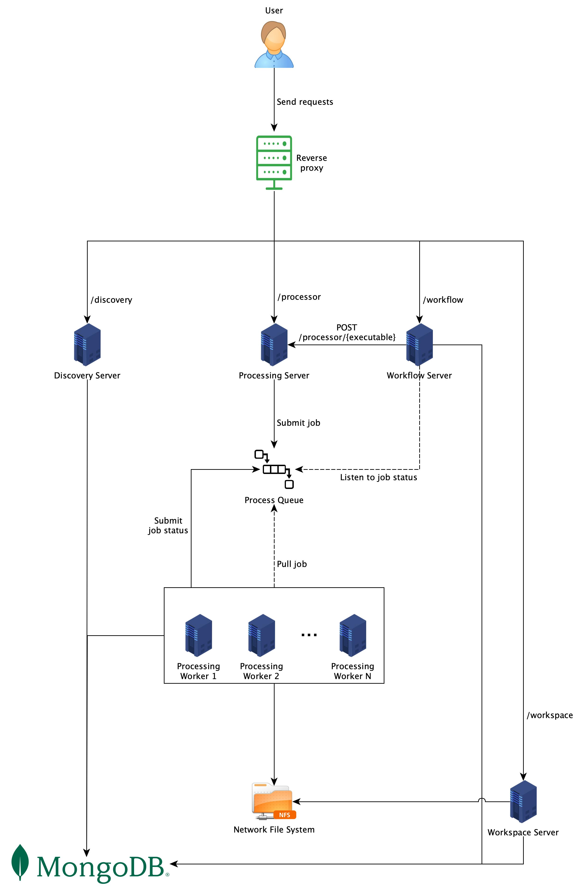

# Web API

## Why do we need a Web API?

After having processors running locally via the [CLI](https://ocr-d.de/en/spec/cli), communication over network is the
natural extension. This feature will improve the flexibility, scalability and reliability of the system. This
specification presents ideas behind the endpoints, how to use them, and technical details happening in the background.

## The Specification

The Web API specification can be found [here](openapi.yml). It follows
the [OpenAPI specification](https://swagger.io/specification/). There are 4 parts to be implemented: discovery,
processing, workflow, and workspace.

**Discovery**: The service endpoints in this section provide information about the server. They include, but are not
limited to, hardware configuration, installed processors, and information about each processor.

**Processing**: Via the service endpoints in this section, one can get information about a
specific [processor](https://ocr-d.de/en/spec/glossary#ocr-d-processor), trigger a processor run, and check a status of
a running processor. By exposing these endpoints, the server can encapsulate the detailed setup of the system and offer
users a single entry to the processors. The implementation of this section is provided
by [OCR-D Core](https://github.com/OCR-D/core). Implementors do not need to implement it.

**Workflow**: Beyond single processors, one can manage
entire [workflows](https://ocr-d.de/en/spec/glossary#ocr-d-workflow), i.e. a series of connected processor
configurations. In this spec, a workflow amounts to a [Nextflow](https://www.nextflow.io/) script. Some information
about Nextflow and how to use it in OCR-D is documented [here](nextflow.md).

**Workspace**: The service endpoints in this section concern data management, which in OCR-D is handled
via [workspaces](https://ocr-d.de/en/spec/glossary#workspace). Processing (via single processors or workflows) always
refers to existing workspaces.

## Usage

When a system implements the Web API completely, it can be used as follows:

1. Retrieve information about the system via endpoints in the `Discovery` section.
2. Create a workspace via the `POST /workspace` endpoint and gets back a workspace ID.
3. Create a workflow by uploading a Nextflow script to the system via the `POST /workflow` endpoint and get back a
   workflow ID.
4. One can either:
    * Trigger a single processor on a workspace by calling the `POST /processor/{executable}` endpoint with the chosen
      processor name and workspace ID, or
    * Start a workflow on a workspace by calling the `POST /workflow/{workflow-id}` endpoint with the chosen workflow ID
      and workspace ID.
    * In both case, a job ID is returned.
5. With the given job ID, it is possible to check the job status by calling:
    * `GET /processor/{executable}/{job-id}` for a single processor, or
    * `GET /workflow/{workflow-id}/{job-id}` for the workflow.
6. The result can be downloaded by calling the `GET /workspace/{workspace-id}` endpoint with the
   header `Accept: application/vnd.ocrd+zip`. Without that header, only the metadata of the specified workspace is
   returned.

## Suggested OCR-D System Architecture

There are various ways to build a system which implements this Web API. In this section, we describe a distributed
architecture, which greatly improves the scalability, flexibility, and reliability of the system compared to
the [CLI](https://ocr-d.de/en/spec/cli) approach.

<figure>
  
  <figcaption align="center">
    <b>Fig. 1:</b> OCR-D System Architecture
  </figcaption>
</figure>

### Description

As shown in Fig. 1, each section in the [Web API specification](#the-specification) is implemented by different servers,
which are Discovery Server, Processing Broker, Workflow Server, and Workspace Server respectively. Although each server
in the figure is deployed on its own machine, it is completely up to the implementors to decide which machines run which
servers. However, having each processor run on its own machine reduces the risk of version and resource conflicts.
Furthermore, the machine can be customized to best fit the processor's hardware requirements and throughput demand. For
example, some processors need GPU computation, while others do not, or some need more CPU capacity while others need
more memory. It is also easier to scale up the processors, or even apply Function-as-a-Service on some of them, which
are not constantly used, to save resources.

**Processing**: since the `Processing` section is provided by [OCR-D Core](https://github.com/OCR-D/core), implementors
do not need to implement Processing Broker, Message Queue, and Processing Server. Once a request comes, the broker
pre-processes it if necessary, and push it to an appropriate queue. A processing queue always has the same name as its
respective processors. For example, `ocrd-olena-binarize` processors listen only to the queue
named `ocrd-olena-binarize`. A Processing Server, which is
an [OCR-D Processor](https://ocr-d.de/en/spec/glossary#ocr-d-processor) running as a worker, listens to the queue, pulls
new jobs when available, processes them, and returns results. One do not call a Processing Server directly, but via a
Processing Broker. Job statuses can be pushed back to the queue, depending on the [job configuration](#message-queue),
so that other services get updates and act accordingly.

**Database**: in this architecture, a database is required to store necessary information such as users requests, jobs
statuses, workspaces, etc. We recommend to use [MongoDB](https://www.mongodb.com/) since it is used by Processing
Servers, but other kinds of storage may work as well.

**Network File System**: in order to avoid file transfer between different machines, it is highly recommended to have
a [Network File System](https://en.wikipedia.org/wiki/Network_File_System) set up. With NFS, all Processing Servers
(specifically processors) can work in a shared storage environment and access files as if they are local files. To get
data into the NFS, one could use the `POST /workspace` endpoint to upload [OCRD-ZIP](https://ocr-d.de/en/spec/ocrd_zip)
files. However, this approach is only appropriate for small data size. Usually, Workspace Server should be able to pull
data from other storages.

### Processing Broker

A Processing Broker is a server which exposes REST endpoints in the `Processing` section of
the [Web API specification](openapi.yml). There are two types of task performed by a broker: deployment management and
message producer. For the former, a broker can deploy, re-use, and shutdown Processing Servers, Message Queue, and
Database, depending on the configuration. To start a Processing Broker, run

```shell
$ ocrd processing-broker /path/to/config.yml
```

The schema of this configuration file can be found [here](web_api/config.schema.yml). Below is a small example of how
the file might look like.

```yaml
message_queue:
  address: localhost
  port: 5672
  ssh:
    username: cloud
    password: 1234
mongo_db:
  address: localhost
  port: 27017
  credentials:
    username: admin
    password: admin
  ssh:
    username: cloud
    password: 1234
hosts:
  - address: localhost
    username: cloud
    password: 1234
    deploy_processors:
      - name: ocrd-cis-ocropy-binarize
        number_of_instance: 2
        type: native
      - name: ocrd-olena-binarize
        number_of_instance: 1
        type: docker

  - address: 134.76.1.1
    username: tdoan
    path_to_privkey: /path/to/file
    deploy_processors:
      - name: ocrd-eynollah-segment
        number_of_instance: 1
        type: native
```

There are three main sections in the configuration file.

1. `message_queue`: it contains the `address` and `port`, where the queue was deployed, or will be deployed. If
   the `ssh` property is presented, the Processing Broker will try to connect to the `address` via `ssh` with
   provided `username` and `password` and deploy [RabbitMQ](https://www.rabbitmq.com/) at the specified `port`. The
   remote machine must have [Docker](https://www.docker.com/) installed since the deployment is done via Docker. Make
   sure that the provided `username` has enough rights to run Docker commands. In case the `ssh` property is not
   presented, the Processing Broker assumes that RabbitMQ was already deployed and just uses it.
2. `mongo_db`: this section also contains the `address` and `port`, where the [MongoDB](https://www.mongodb.com/) is
   running, or will run. If `credentials` is presented, it will be used when connecting to the database. The `ssh`
   section behaves exactly the same as described in the `message_queue` section above.
3. `hosts`: this section contains a list of hosts, usually virtual machines, where Processing Servers should be
   deployed. To be able to connect to a host, an `address` and `username` are required, then comes either `password`
   or `path_to_privkey` (path to a private key). All Processing Servers, which will be deployed, must be declared under
   the `deploy_processors` property. In case `type` is `docker`, make sure that [Docker](https://www.docker.com/) is
   installed in the target machine and the provided `username` has enough rights to execute Docker commands.

Among three sections, only the `message_queue` is required. However, if `hosts` is presented, `mongo_db` must be there
as well. For more information, please check the [configuration file schema](web_api/config.schema.yml).

### Message Queue

### Database

The database is required to store necessary information such as users requests, jobs statuses, workspaces, etc. We
recommend to use [MongoDB](https://www.mongodb.com/) since it is used by Processing Servers, but other kinds of storage
may work as well. However, there must be a MongoDB running in the system because all Processing Servers will read and
write to it. To connect to MongoDB via a Graphical User
Interface, [MongoDB Compass](https://www.mongodb.com/products/compass) is recommended.

When a Processing Server connects to the database for the first time, it will create a database called `ocrd`.
For collections, each processor creates and works on a collection with the same name as its own. For example,
all `ocrd-olena-binarize` processors will read and write to the `ocrd-olena-binarize` collection only.
